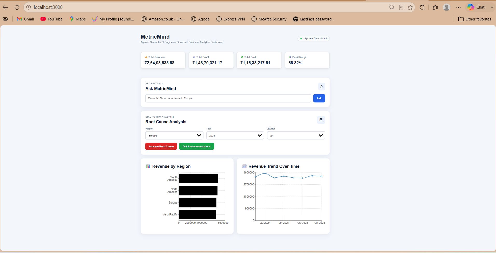
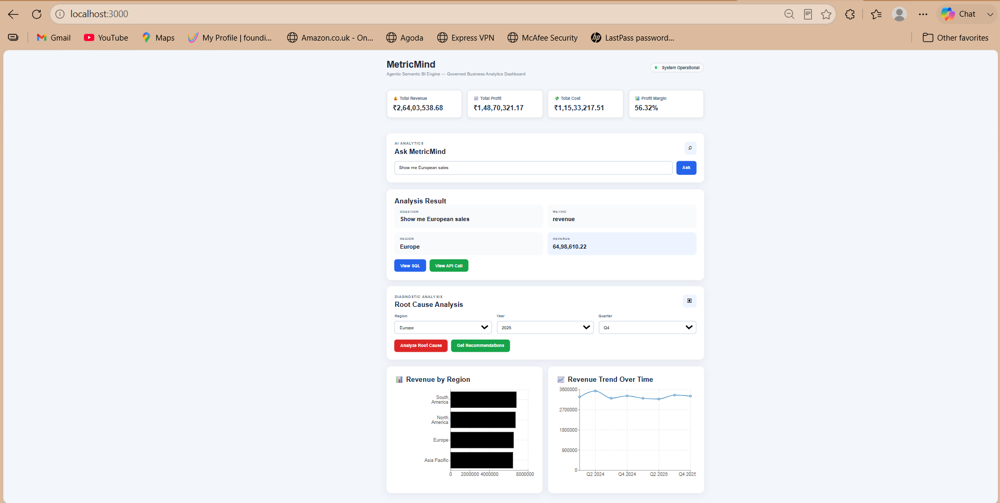
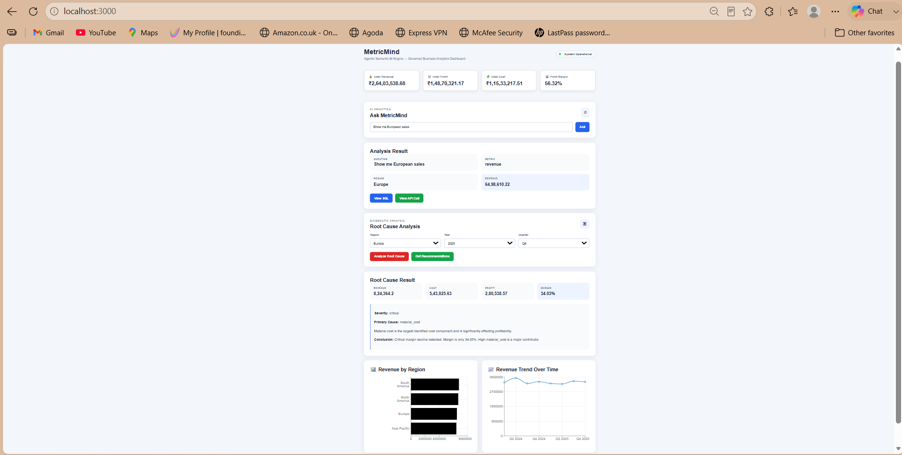
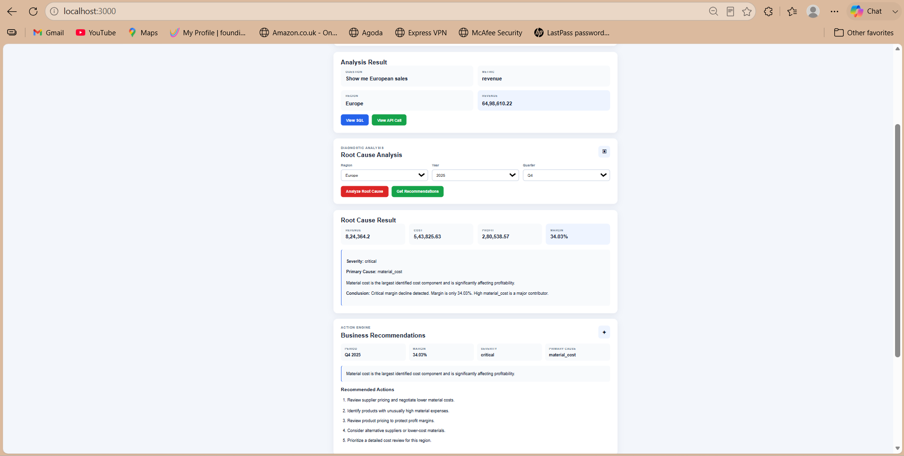
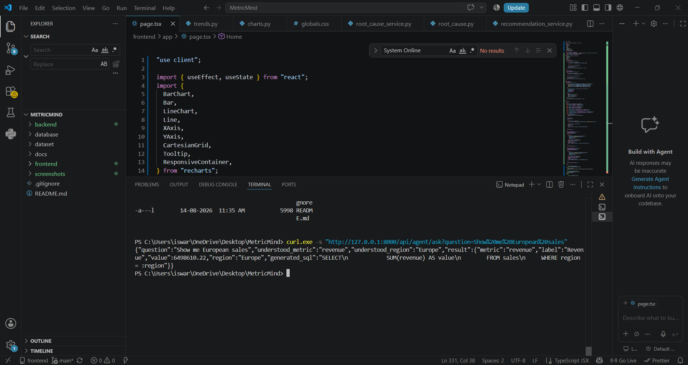
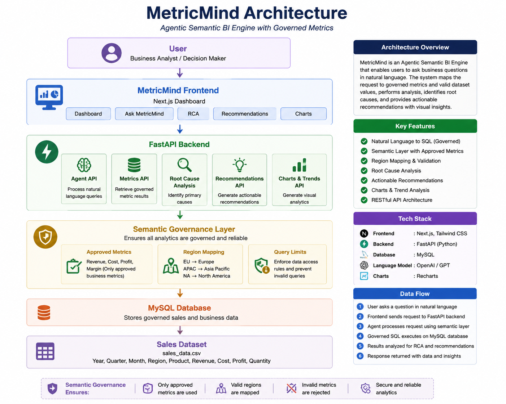

\# MetricMind — Agentic Semantic BI Engine


\## 📊 Project Overview


MetricMind is an Agentic Semantic Business Intelligence Engine designed to provide governed, reliable, and interactive business analytics.


The system connects a modern frontend dashboard with a FastAPI backend and a MySQL database. It uses a semantic analytics layer to ensure that business metrics such as Revenue, Cost, Profit, and Profit Margin are consistently calculated.


The goal of MetricMind is to reduce incorrect metric interpretation and provide users with meaningful insights, trend analysis, root cause analysis, and business recommendations.


\---


\## ✨ Key Features


\* 📈 Interactive Business Intelligence Dashboard

\* 💰 KPI Metrics: Revenue, Cost, Profit, and Profit Margin

\* 🤖 Natural Language Business Questions

\* 📊 Revenue by Region Visualization

\* 📉 Revenue Trend Analysis

\* 🔍 Root Cause Analysis

\* 💡 Business Recommendations

\* 🧠 Semantic Metric Layer

\* 📝 Governed Analytics and Audit Support

\* 🔌 REST API Architecture

\* 🗄️ MySQL Database Integration


\---


\## 🏗️ System Architecture


```text

User

&#x20; │

&#x20; ▼

Next.js Frontend Dashboard

&#x20; │

&#x20; ▼

FastAPI Backend

&#x20; │

&#x20; ├── Semantic Service

&#x20; ├── Agent Service

&#x20; ├── Root Cause Service

&#x20; ├── Recommendation Service

&#x20; │

&#x20; ▼

MySQL Database

&#x20; │

&#x20; ▼

Business Analytics Data

```


\---


\## 🛠️ Technology Stack


\### Frontend


\* Next.js

\* React

\* TypeScript

\* Recharts

\* CSS


\### Backend


\* Python

\* FastAPI

\* Uvicorn

\* SQLAlchemy


\### Database


\* MySQL


\### Development Tools


\* Visual Studio Code

\* MySQL Workbench

\* Git

\* GitHub


\---


\## 📁 Project Structure


```text

MetricMind/

│

├── backend/

│   ├── app/

│   │   ├── routes/

│   │   ├── services/

│   │   ├── database.py

│   │   └── main.py

│   └── import\_data.py

│

├── frontend/

│   ├── app/

│   │   ├── page.tsx

│   │   ├── globals.css

│   │   └── layout.tsx

│   ├── public/

│   └── package.json

│

├── dataset/

│   ├── generate\_data.py

│   └── sales\_data.csv

│

├── docs/

│   ├── WEEK1.md

│   ├── WEEK2.md

│   ├── WEEK3.md

│   └── WEEK4.md

│

└── README.md

```


\---


\## 🚀 How to Run the Project


\### 1. Clone the Repository


```bash

git clone https://github.com/gnaneswar-reddy-123/MetricMind.git

cd MetricMind

```


\### 2. Start the Backend


```bash

cd backend

python -m uvicorn app.main:app --reload

```


The backend runs at:


`http://127.0.0.1:8000`


API documentation:


`http://127.0.0.1:8000/docs`


\### 3. Start the Frontend


Open another terminal:


```bash

cd frontend

npm install

npm run dev

```


The frontend runs at:


`http://localhost:3000`


\---


\## 🔌 API Endpoints


| Endpoint                        | Description                |

| ------------------------------- | -------------------------- |

| `/`                             | API status                 |

| `/health`                       | Health check               |

| `/api/metrics`                  | Available business metrics |

| `/api/metrics/summary`          | KPI metric summary         |

| `/api/agent/ask`                | Ask business questions     |

| `/api/trends/revenue`           | Revenue trend data         |

| `/api/charts/revenue-by-region` | Revenue by region          |

| `/api/root-cause/analyze`       | Root cause analysis        |

| `/api/recommendations/generate` | Business recommendations   |


\---


\## 📊 Business Metrics


MetricMind provides governed business metrics including:


\### Revenue


Total sales revenue generated by the business.


\### Cost


Total business cost associated with sales.


\### Profit


Profit is calculated based on revenue and cost.


\### Profit Margin


Profit margin represents profitability as a percentage of revenue.


\---


\## 🎯 Project Workflow


1\. Generate and prepare business sales data.

2\. Store analytics data in MySQL.

3\. Define governed business metrics.

4\. Build REST APIs using FastAPI.

5\. Process business questions through the agent layer.

6\. Perform trend and chart analysis.

7\. Identify possible root causes.

8\. Generate actionable recommendations.

9\. Display insights in the Next.js dashboard.


\---


\## 📅 Development Progress


\* \*\*Week 1:\*\* Database and Data Foundation

\* \*\*Week 2:\*\* Backend and Semantic Layer

\* \*\*Week 3:\*\* Backend API and Semantic Analytics Development

\* \*\*Week 4:\*\* Testing and Project Validation


Detailed weekly progress is available in the `docs` folder.


\---


\## 🔮 Future Enhancements


\* Advanced LLM-powered query interpretation

\* User authentication and role-based access

\* More business metrics and semantic definitions

\* Export reports to PDF and Excel

\* Advanced anomaly detection

\* Real-time analytics

\* Cloud deployment

\* Improved AI-generated recommendations


## Project Screenshots

### Dashboard



The main MetricMind dashboard displays governed business KPIs including Total Revenue, Total Profit, Total Cost, and Profit Margin, along with Revenue by Region and Revenue Trend visualizations.

### Ask MetricMind



Users can ask business questions in natural language. The system maps the request to approved semantic metrics and valid dataset values before returning the result.

### Root Cause Analysis



The Root Cause Analysis module analyzes business performance for a selected region and time period and identifies the primary factor affecting profitability.

### Business Recommendations



Based on the analytical results, MetricMind generates actionable business recommendations to help address identified performance issues.

### API Verification



The backend API was tested using the query **"Show me European sales"**. MetricMind correctly identified the approved metric as **Revenue**, mapped the region to **Europe**, and returned the governed analytical result.


## Automated Governance Tests

MetricMind includes automated tests to verify semantic governance and metric consistency.

Run the tests from the backend folder:

```powershell
python -m pytest tests\test_governance.py -v
```

Latest result:

```text
4 passed
```

The automated tests verify:

* Revenue returns consistent results across repeated governed queries
* Unsupported metrics such as `salary` are rejected
* Region aliases such as `asia` correctly map to `Asia Pacific`
* Only approved metrics are exposed: Revenue, Cost, Profit, and Margin


## System Architecture

MetricMind follows a governed end-to-end analytics architecture. User requests flow from the Next.js dashboard through the FastAPI backend, where the Semantic Governance Layer validates approved metrics, maps valid regions, and applies query limits before analytics are executed on the MySQL sales database.



### Architecture Flow

**User → Next.js Frontend → FastAPI Backend → Semantic Governance Layer → MySQL Database → Governed Analytics Results**

The architecture supports:

* Governed metrics: Revenue, Cost, Profit, and Margin
* Natural-language business queries
* Valid region mapping
* Invalid metric rejection
* Query governance and row limits
* Root Cause Analysis
* Business recommendations
* Revenue charts and trend analysis


\---


\## 👨‍💻 Author


\*\*Y V Gnaneswar Reddy\*\*


GitHub: https://github.com/gnaneswar-reddy-123


LinkedIn: https://www.linkedin.com/in/yandapalli-venkata-gnaneswar-reddy-718994352


